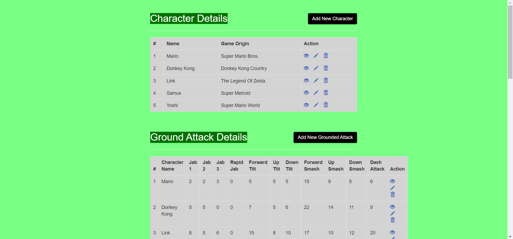
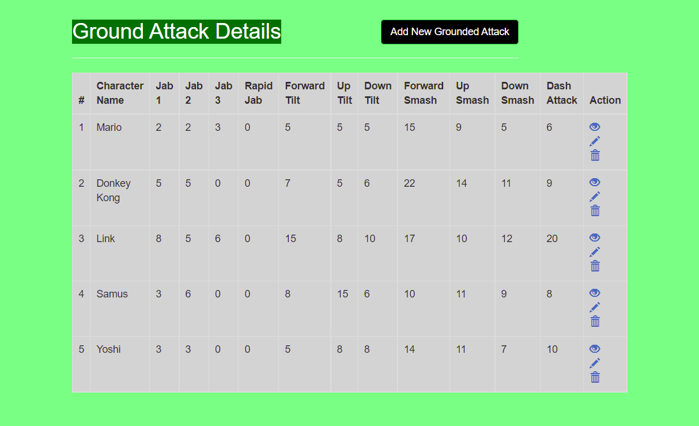
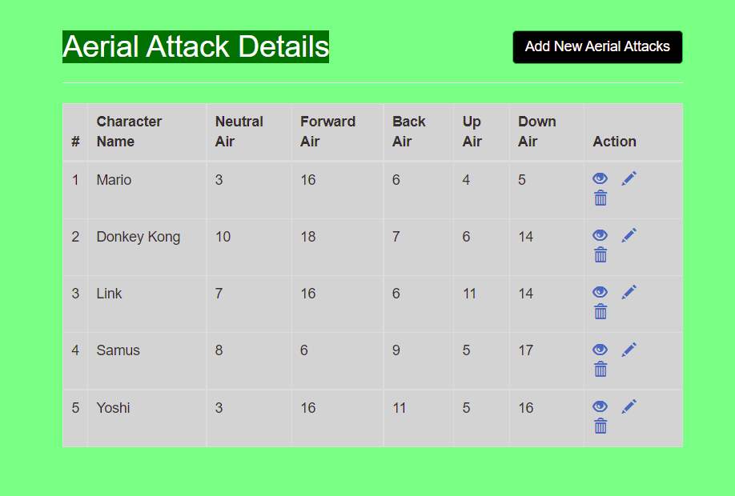
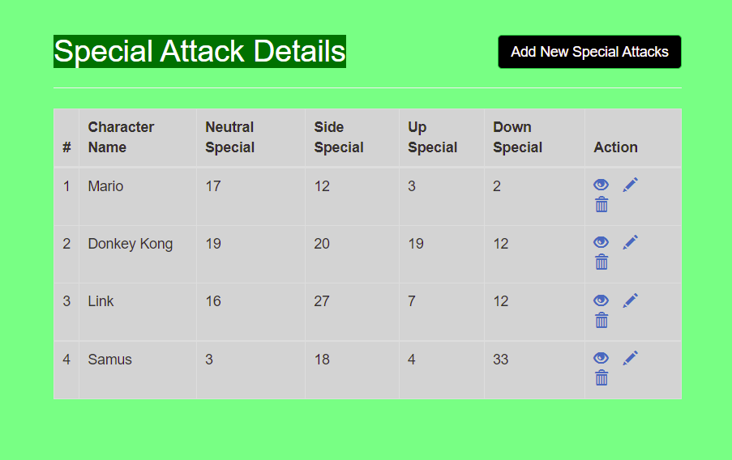
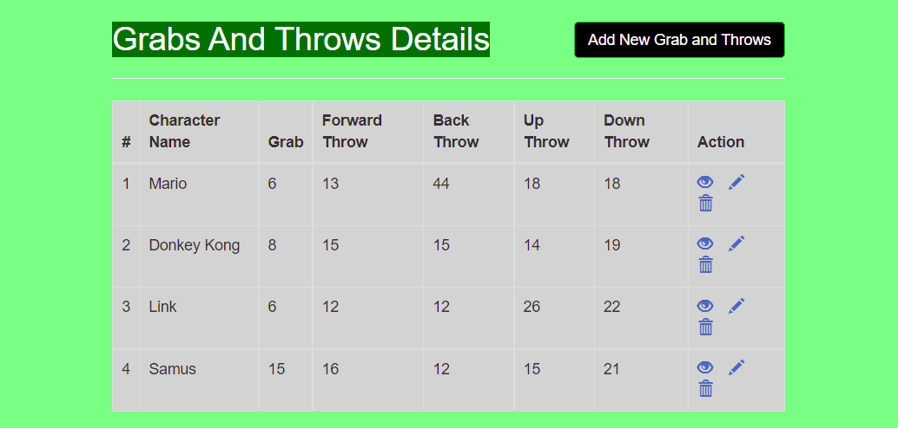
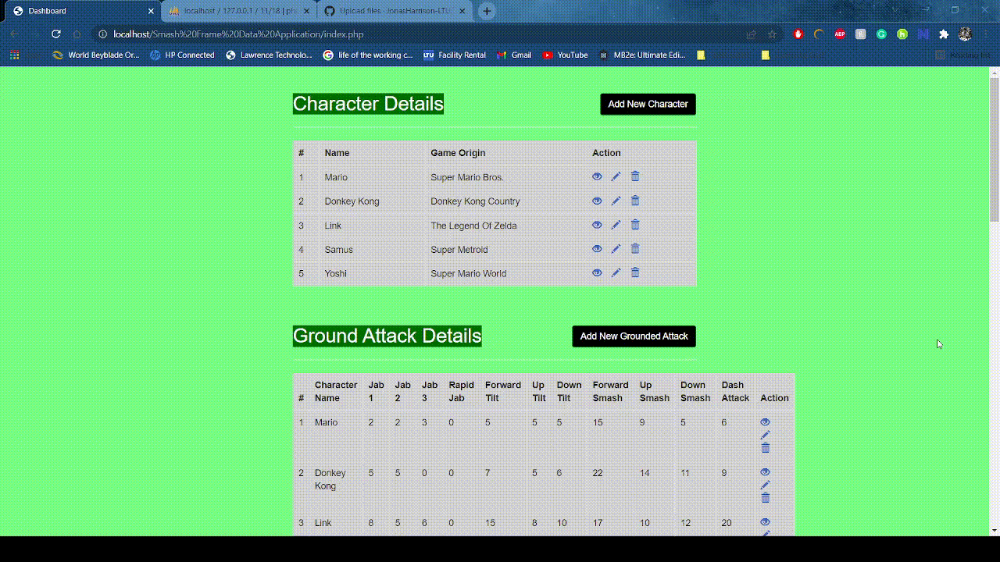
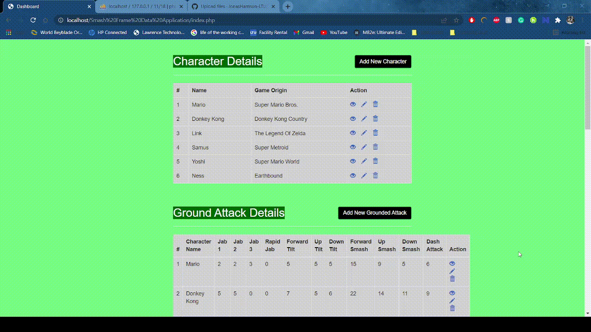
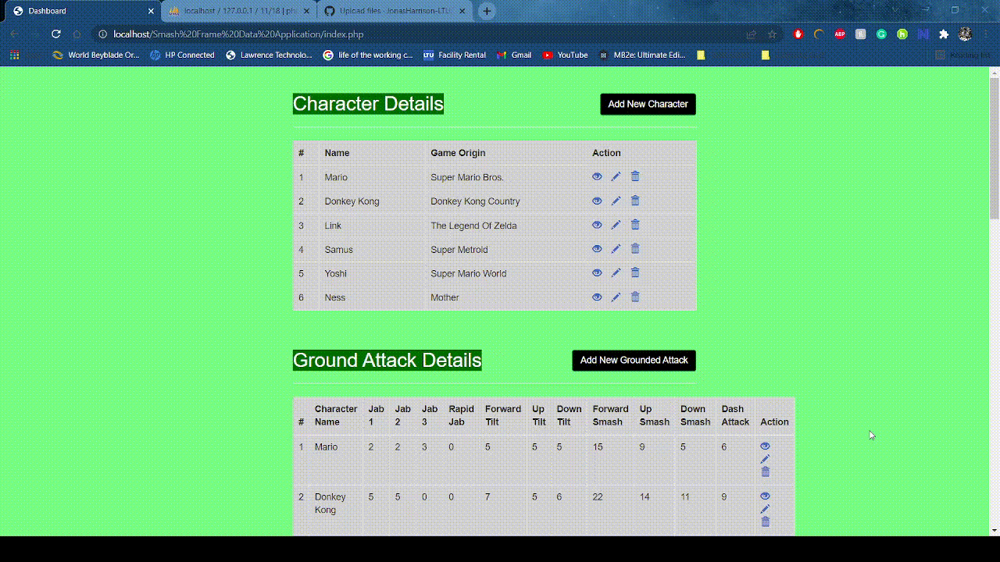

# Smash-Frame-Data-Application
 This is a CRUD application that I designed for my Intro to Databases class

## Tables

There are 5 tables in the database, Characters, Grounded Attacks, Aerial Attacks, Special Attacks, and Grabs and Throws. The Characters table holds all the characters and the game that they originate from. The next 4 tables hold the value of the first active frame for the indicated move. For example, the first active frame for Mario's up smash is frame 9. This can also be read as "Mario's up smash comes out on frame 9"

## CREATE FUNCTIONALITY

Selecting "Add New Character" and filling out the information sends an INSERT sql statement to the database.

## READ FUNCTIONALITY

Selecting the eye icon will send a SELECT statement to the database to show the record.

## UPDATE FUNCTIONALITY

Selecting the pencil icon and changing the information will send an UPDATE statement to the database and updates to reflect the change.

## DELETE FUNCTIONALITY

Selecting the trash can icon will take you to a screen where it confirms that you want to delete the record, then sends a DELETE statment to the database.
